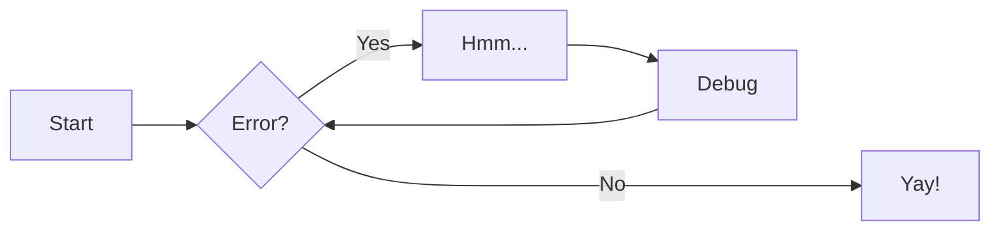

# Mermaid Diagrams

I was playing around with this for some time and found that mkdocs can render mermaid diagram using mermaid2 plugin:

```yaml
plugins:
  - mermaid2
```

Unfortunately it seems that backstage techdocs will not include the javascripts necessary. I have read that it may be possible to include these scripts as part of the backstage frontend.


