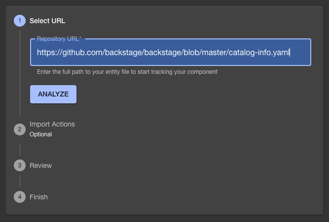

# Techdocs

As this backstage instance was created from an [npx template](https://backstage.io/docs/getting-started/create-an-app#create-an-app) the backstage app already has the required plugin, source code and configuration.

To display the documentation from a repository we'll need to ['Register an existing component'](https://backstage.io/docs/getting-started/configuration#register-an-existing-component).

## Adding docs to your repository

Techdocs uses mkdocs and this requires a `mkdocs.yml` file. This is necessary and you must define the pages in the `nav:` section like so:

A good example can also be found from mkdocs:
- [mkdocs.yml](https://github.com/mkdocs/mkdocs/blob/master/mkdocs.yml)
- [mkdocs documentation[(https://www.mkdocs.org/getting-started/)